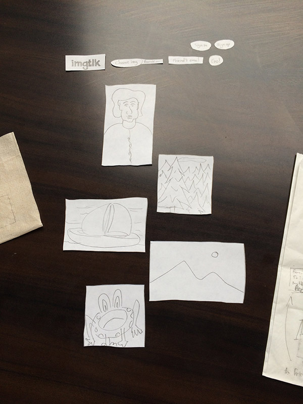

# imgtlk
Application prototype to have a conversation using images

## Things To Do
* Publish brief overview with signup for [Mailchimp](http://mailchimp.com/) mailinglist form on Google App Engine to test interest.
* Most Valuable Product: 
  * Upload a photo and send an email to a friend inviting them to post a photo in response
   * How to post an image with [Node.js](http://www.slideshare.net/simon/evented-io-based-web-servers-explained-using-bunnies). [What is Node.js](https://stackoverflow.com/questions/1884724/what-is-node-js)?
   * How to send an email with Node
   * How to create a random URL with Node (need to think about [URLs](http://warpspire.com/posts/url-design/)
     * **/** - homepage
       * logged in: 2 columns, one showing your conversations, other showing conversations you follow and/or popular conversations
       * logged out: popular posts
      * **/signin/** - with Google/Facebook/Twitter
      * **/u/simon/** - own profile
      * **/u/simon/editprofile/** - edit own profile (First Name, Last Name, Website, Picture, your username is your email address, Extra emails?) 
      * **/c/beautiful-mongoose-34/** - randomly generated unique human-readable conversation URL. Or just **/c/123/** incrementing number?
        * Conversation between Simon and Sam
        * Images
        * Post reply
        * At first only two people. Possibly allow for more later.
      * **/c/beautiful-mongoose-34/#5** - direct link to an image in the conversation
      * **/post/** - sends first image to conversation URL and sends an email to chosen friend's email address
        * Email - You have received an invite to have an image conversation using imgtlk <a href="http://imgtlk.com/beautiful-mongoose-34?post-reply-random-hash-to-enable-reply-from-this-address-only?">Reply</a>
        * **/c/beautiful-mongoose-34/** --> **/post/** button to reply directly above and to one-side of first/latest image from friend. Email is sent to friend to notify of reply: "Your friend _____ has replied to your conversation at..."
        * ¿What is the default image maximum width? **500px**? **1080px**?
      * **/beautiful-mongoose-34/edit/** Should a person be able to edit their image once it has been posted? Or only delete it? Probably only delete it — image would be replaced with 'image was deleted'.
      * **/signout/** - Thanks for tlking! See you again soon. imgtlk homepage.     
* Single-page interface prototype
  * Use [Masonry](https://github.com/desandro/masonry)? Maybe later. No unecessary JS to keep things fast and simple.
* One page
  * Upload image
  * Send email to friend you want to tlk to
  * Signup and login flows (use <https://github.com/sahat/hackathon-starter>?). Google, Facebook, Twitter, GitHub to sign in.
* Implement friendship database schema - NoSQL [GAE Datastore](https://cloud.google.com/datastore/). Needed? Eventually ability to follow others?
* See [nodejs GAE quickstart](https://cloud.google.com/nodejs/). Use [Express framework](http://expressjs.com/en/guide/routing.html).
